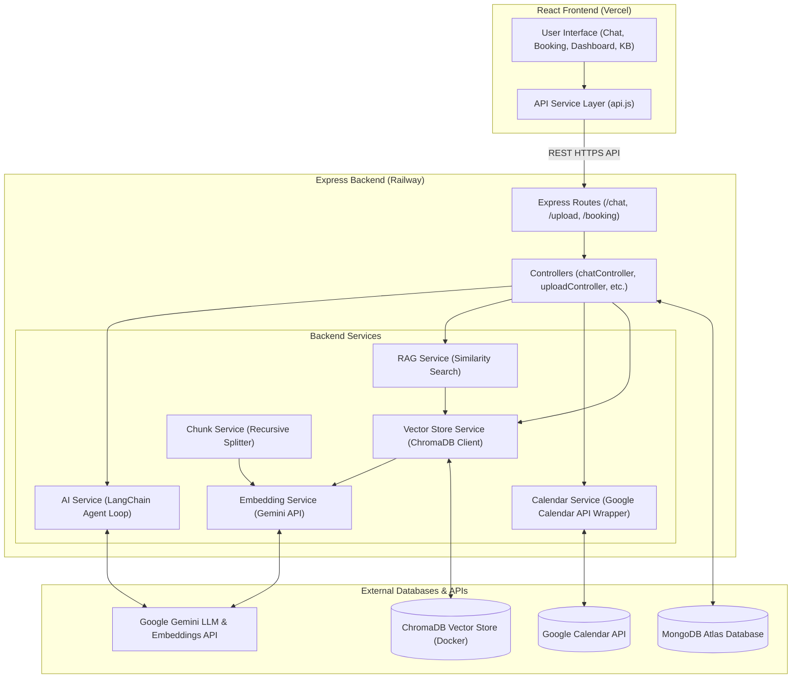
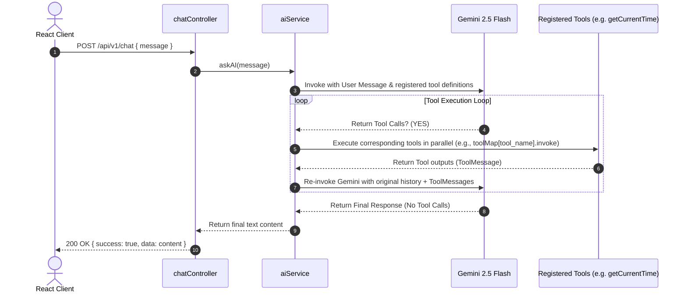
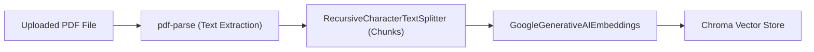

# 🤖 AI Business Receptionist: Architecture, File Inventory, & Implementation Status

This document provides a comprehensive overview of the **AI Business Receptionist** project. It is designed to serve as a complete transfer of context, architecture, file structure, and development roadmap. Any developer or AI Agent reading this document will be fully equipped to understand the project structure and immediately proceed with implementing remaining features.

---

## 🏗️ 1. System Architecture

The AI Business Receptionist is a full-stack, decoupled application. It utilizes a React Single Page Application (SPA) frontend and a Node.js Express REST API backend. It leverages **LangChain**, **Google Gemini 2.5 Flash**, **ChromaDB** (for vector storage/RAG), **MongoDB Atlas** (for primary data storage), and the **Google Calendar API** (for booking management).

### 1.1 High-Level Architecture
The diagram below represents how the system components communicate:



---

### 1.2 Conversational AI & Tool Loop
The backend's core conversational intelligence runs on **LangChain's Tool Calling Execution Loop** using Gemini 2.5 Flash. The agent processes instructions and executes registered tools dynamically in a loop:



---

### 1.3 Knowledge Ingestion (RAG) Flow
When a user uploads a business PDF context document, it goes through an ingestion pipeline:



---

## 📁 2. Directory & File Inventory

Below is an alphabetical layout of all files currently tracked in the repository, along with detailed explanations of their purpose.

### 2.1 Project Root Files
| File Name | Purpose / Functionality |
| :--- | :--- |
| [`.gitignore`](file:///c:/Users/Gautam/ai-business-receptionist/.gitignore) | Configures files and directories that Git should ignore (e.g., `node_modules`, environment files). |
| [`README.md`](file:///c:/Users/Gautam/ai-business-receptionist/README.md) | The developer-facing user manual including high-level architecture diagram, API references, backend & frontend setup details, and environment variables. |
| [`docker-compose.yml`](file:///c:/Users/Gautam/ai-business-receptionist/docker-compose.yml) | Local multi-container Docker config to spin up a local instance of the ChromaDB server (default port `8000`) for vector ingestion and retrieval. |

---

### 2.2 Client Folder (`client/`)
The React web frontend is built using React 19, Vite, Tailwind CSS v4, Framer Motion, and shadcn/ui.

| File / Folder Path | Purpose / Functionality |
| :--- | :--- |
| [`client/.env.example`](file:///c:/Users/Gautam/ai-business-receptionist/client/.env.example) | Example environment variables file showing key frontend configurations (`VITE_API_URL`). |
| [`client/.gitignore`](file:///c:/Users/Gautam/ai-business-receptionist/client/.gitignore) | Configures client-specific files to ignore from Git commits (e.g. `dist`, local builds, `node_modules`). |
| [`client/README.md`](file:///c:/Users/Gautam/ai-business-receptionist/client/README.md) | Client-specific developer setup guide for running and building the Vite frontend. |
| [`client/eslint.config.js`](file:///c:/Users/Gautam/ai-business-receptionist/client/eslint.config.js) | Configures code-linting rules for JavaScript, React Hooks, and Fast Refresh inside the client project. |
| [`client/index.html`](file:///c:/Users/Gautam/ai-business-receptionist/client/index.html) | Root HTML entry file containing the DOM insertion element `<div id="root">` where the React app renders. |
| [`client/jsconfig.json`](file:///c:/Users/Gautam/ai-business-receptionist/client/jsconfig.json) | Configures JavaScript language service compiler paths (aliasing `@/*` to `src/*` for cleaner imports). |
| [`client/package.json`](file:///c:/Users/Gautam/ai-business-receptionist/client/package.json) | Lists packages and dependencies required for frontend development (e.g. Tailwind v4, Framer Motion, React Router v7, Radix UI, Lucide icons) and scripts to run/build/preview the app. |
| [`client/package-lock.json`](file:///c:/Users/Gautam/ai-business-receptionist/client/package-lock.json) | Autogenerated dependency lock file ensuring consistent package installs across developer machines. |
| [`client/vercel.json`](file:///c:/Users/Gautam/ai-business-receptionist/client/vercel.json) | Deployment instructions for Vercel ensuring all routes redirect to `index.html` for single-page client routing. |
| [`client/vite.config.js`](file:///c:/Users/Gautam/ai-business-receptionist/client/vite.config.js) | Configuration for the Vite development server and build pipeline, registering Tailwind CSS and React plugins. |
| `client/public/` | Directory for public assets like favicons (`favicon.svg`, `icons.svg`) directly served by Vite. |
| `client/src/assets/` | Houses client graphics and mock assets (`hero.png`, `react.svg`, `vite.svg`). |
| [`client/src/components/layout/Layout.jsx`](file:///c:/Users/Gautam/ai-business-receptionist/client/src/components/layout/Layout.jsx) | Main wrapper containing a layout template that injects the responsive desktop sidebar, a mobile top-bar header, mobile bottom navigation, and page outlet. |
| [`client/src/components/layout/Sidebar.jsx`](file:///c:/Users/Gautam/ai-business-receptionist/client/src/components/layout/Sidebar.jsx) | Left navigation sidebar displayed on desktop. Houses main menu routing items, `ThemeToggle`, and the user profile summary. |
| [`client/src/components/ui/ThemeToggle.jsx`](file:///c:/Users/Gautam/ai-business-receptionist/client/src/components/ui/ThemeToggle.jsx) | Clickable header icon containing animations to switch the website theme between light and dark modes. |
| `client/src/components/ui/` | Contains reusable basic UI building blocks (e.g., [`badge.jsx`](file:///c:/Users/Gautam/ai-business-receptionist/client/src/components/ui/badge.jsx), [`button.jsx`](file:///c:/Users/Gautam/ai-business-receptionist/client/src/components/ui/button.jsx), [`card.jsx`](file:///c:/Users/Gautam/ai-business-receptionist/client/src/components/ui/card.jsx), [`input.jsx`](file:///c:/Users/Gautam/ai-business-receptionist/client/src/components/ui/input.jsx)) adapted from shadcn/ui. |
| [`client/src/index.css`](file:///c:/Users/Gautam/ai-business-receptionist/client/src/index.css) | Core global stylesheet loading Tailwind CSS v4 directives, setting up typography (Inter or Roboto fonts), HSL-based color mappings, custom variables, and theme modifiers. |
| [`client/src/lib/theme.jsx`](file:///c:/Users/Gautam/ai-business-receptionist/client/src/lib/theme.jsx) | React Context Provider (`ThemeProvider` and custom `useTheme` hook) controlling light/dark variables, reading/writing local storage, and dynamically altering browser class lists. |
| [`client/src/lib/utils.js`](file:///c:/Users/Gautam/ai-business-receptionist/client/src/lib/utils.js) | Defines the core helper `cn` function, which merges Tailwind styles and class names cleanly using `clsx` and `tailwind-merge`. |
| [`client/src/main.jsx`](file:///c:/Users/Gautam/ai-business-receptionist/client/src/main.jsx) | Main Javascript entry point that bootstraps the React application by mounting `<App />` within the HTML `<div id="root">` element. |
| [`client/src/pages/Booking.jsx`](file:///c:/Users/Gautam/ai-business-receptionist/client/src/pages/Booking.jsx) | Screen to display upcoming appointments. Includes an interactive calendar/date-selector widget enabling front desk staff to schedule meetings manually on behalf of clients. |
| [`client/src/pages/Chat.jsx`](file:///c:/Users/Gautam/ai-business-receptionist/client/src/pages/Chat.jsx) | Beautiful main conversational dashboard screen where users chat with the receptionist. Displays prompt suggestions, handles user typing indicators, custom text areas, and auto-scrolling lists. |
| [`client/src/pages/Dashboard.jsx`](file:///c:/Users/Gautam/ai-business-receptionist/client/src/pages/Dashboard.jsx) | Overview analytics dashboard. Shows key KPIs (Conversations count, Bookings count, Brain Document count, Uptime status), a dynamic conversation volume activity chart, and a live recent-activity timeline. |
| [`client/src/pages/KnowledgeBase.jsx`](file:///c:/Users/Gautam/ai-business-receptionist/client/src/pages/KnowledgeBase.jsx) | Screen where users upload business PDFs to teach the receptionist new knowledge. Handles drop-zone triggers, mock document processing list grids, and file size metadata. |
| [`client/src/pages/Landing.jsx`](file:///c:/Users/Gautam/ai-business-receptionist/client/src/pages/Landing.jsx) | Sleek marketing landing page displaying animations, feature blocks, testimonial quotes, sequential steps carousel, and direct entry points to try the AI chat app. |
| [`client/src/pages/Settings.jsx`](file:///c:/Users/Gautam/ai-business-receptionist/client/src/pages/Settings.jsx) | App options configuration page layout. Features Tab navigation to configure Profile Details, Appearance theme, Notification rules, AI Tone of Voice, Integrations (e.g. Google Calendar), and Account Deletion. |
| [`client/src/services/api.js`](file:///c:/Users/Gautam/ai-business-receptionist/client/src/services/api.js) | Network request service layer containing client methods to call backend API endpoints (`/chat` for agent prompts and `/upload` for PDF uploads). |

---

### 2.3 Server Folder (`server/`)
The backend is a Node/Express server running LangChain orchestrations, ChromaDB operations, Google Calendar bindings, and MongoDB data interactions.

| File / Folder Path | Purpose / Functionality |
| :--- | :--- |
| [`server/.env.example`](file:///c:/Users/Gautam/ai-business-receptionist/server/.env.example) | Example environment template showing required secret keys (MongoDB connection URIs, Google and Gemini API keys, Service Account path, and frontend URL). |
| [`server/Procfile`](file:///c:/Users/Gautam/ai-business-receptionist/server/Procfile) | Deployment process command instruction (`web: node src/server.js`) utilized by Railway or Heroku to initiate the production server. |
| [`server/mcp.yaml`](file:///c:/Users/Gautam/ai-business-receptionist/server/mcp.yaml) | Model Context Protocol configuration specifying server settings. |
| [`server/package.json`](file:///c:/Users/Gautam/ai-business-receptionist/server/package.json) | Main manifest defining server dependencies (Express 5, LangChain core & packages, Chroma client, Mongoose database connector, Google APIs, Multer file extractor, PDF-parse) and npm scripts. |
| [`server/package-lock.json`](file:///c:/Users/Gautam/ai-business-receptionist/server/package-lock.json) | Autogenerated dependency lock file ensuring exact matching modules are installed across server runtimes. |
| [`server/railway.json`](file:///c:/Users/Gautam/ai-business-receptionist/server/railway.json) | Specific configuration mapping build variables and run scripts for deployment on Railway. |
| [`server/src/server.js`](file:///c:/Users/Gautam/ai-business-receptionist/server/src/server.js) | Express server bootstrapping file. Configures CORS, sets Google DNS servers, runs URL parser middlewares, registers endpoints (`/health`, `/upload`, `/chat`, `/booking`), connects to MongoDB, and launches the app listener on the target PORT. |
| [`server/src/app.js`](file:///c:/Users/Gautam/ai-business-receptionist/server/src/app.js) | Empty placeholder file. |
| [`server/src/config/db.js`](file:///c:/Users/Gautam/ai-business-receptionist/server/src/config/db.js) | Initializes the Mongoose library connection to MongoDB Atlas, verifying that `MONGODB_URI` environment variable is defined. |
| [`server/src/config/googleCalendar.js`](file:///c:/Users/Gautam/ai-business-receptionist/server/src/config/googleCalendar.js) | Configures authentications to Google APIs via `GoogleAuth` loading local service-account credentials JSON, exporting a configured calendar instance interface. |
| [`server/src/controllers/bookingController.js`](file:///c:/Users/Gautam/ai-business-receptionist/server/src/controllers/bookingController.js) | Controller exposing test/operational REST endpoints to verify Google Calendar connections, query slot availability, book sessions, reschedule, or cancel them. |
| [`server/src/controllers/chatController.js`](file:///c:/Users/Gautam/ai-business-receptionist/server/src/controllers/chatController.js) | Handles incoming request payloads for `/chat`. Dispatches request queries to RAG pipeline similarity searches (if `question` key is present) or delegates general chat tasks directly to LangChain agents (if `message` key is present). |
| [`server/src/controllers/healthController.js`](file:///c:/Users/Gautam/ai-business-receptionist/server/src/controllers/healthController.js) | Returns basic health metrics JSON confirming backend API endpoints are responsive. |
| [`server/src/controllers/uploadController.js`](file:///c:/Users/Gautam/ai-business-receptionist/server/src/controllers/uploadController.js) | Express handler for `/upload`. Coordinates the pipeline: extracts raw PDF text, formats layout chunks, embeds content vectors, and stores them in ChromaDB. |
| [`server/src/middleware/uploadMiddleware.js`](file:///c:/Users/Gautam/ai-business-receptionist/server/src/middleware/uploadMiddleware.js) | Configures Multer storage location (directs to local folder `upload`), sets unique name suffixes, and parses files to filter/permit only `.pdf` extensions. |
| [`server/src/routes/HelthRoutes.js`](file:///c:/Users/Gautam/ai-business-receptionist/server/src/routes/HelthRoutes.js) | Binds `/api/v1/health` HTTP GET actions to the `healthCheck` controller function. |
| [`server/src/routes/bookingRoutes.js`](file:///c:/Users/Gautam/ai-business-receptionist/server/src/routes/bookingRoutes.js) | Routes linking HTTP request routes (e.g. GET `/test`, GET `/availability`, PATCH `/reschedule/:eventId`) directly to Google Calendar controllers. |
| [`server/src/routes/chatRoutes.js`](file:///c:/Users/Gautam/ai-business-receptionist/server/src/routes/chatRoutes.js) | Directs chat endpoints to the correct controllers: passes general chat messages (`chat`) and PDF semantic queries (`chatWithPDF`). |
| [`server/src/routes/uploadRoutes.js`](file:///c:/Users/Gautam/ai-business-receptionist/server/src/routes/uploadRoutes.js) | Routes binding PDF POST operations to Multer parsing middleware and file loading controller handlers. |
| [`server/src/services/aiService.js`](file:///c:/Users/Gautam/ai-business-receptionist/server/src/services/aiService.js) | The core AI execution hub. Registers tools, compiles the Gemini model, runs the LangChain execution loop, manages parallel tool calling, and handles message histories. |
| [`server/src/services/bookingService.js`](file:///c:/Users/Gautam/ai-business-receptionist/server/src/services/bookingService.js) | Low-level service containing calls to Google Calendar. Handles listing events, inserting sessions, patching slots, checking availability, and searching for the next free slots in `Asia/Kolkata` timezone. |
| [`server/src/services/chatService.js`](file:///c:/Users/Gautam/ai-business-receptionist/server/src/services/chatService.js) | High-level search engine. Queries ChromaDB for the top `k` similar documents, merges them as structured context, and feeds context directly to Gemini LLM to construct answers. |
| [`server/src/services/chunkService.js`](file:///c:/Users/Gautam/ai-business-receptionist/server/src/services/chunkService.js) | Text formatting helper. Leverages LangChain's `RecursiveCharacterTextSplitter` to divide extracted document text into documents with defined sizes (`1000` chars) and overlaps (`200` chars). |
| [`server/src/services/embeddingService.js`](file:///c:/Users/Gautam/ai-business-receptionist/server/src/services/embeddingService.js) | Vector embedding wrapper utilizing the `@langchain/google-genai` model `text-embedding-004` to create text embeddings. |
| [`server/src/services/llmService.js`](file:///c:/Users/Gautam/ai-business-receptionist/server/src/services/llmService.js) | Instantiates the Gemini 2.5 Flash model specifically configured for standalone single-turn QA prompts. |
| [`server/src/services/pdfService.js`](file:///c:/Users/Gautam/ai-business-receptionist/server/src/services/pdfService.js) | Uses `pdf-parse` to read local PDF binaries from disk and return structured raw text. |
| [`server/src/services/vectorStoreService.js`](file:///c:/Users/Gautam/ai-business-receptionist/server/src/services/vectorStoreService.js) | High-level vector store connector. Configures the LangChain Chroma instance client to target local or remote Chroma server collection `pdf_documents`. |
| [`server/src/tools/bookingTools.js`](file:///c:/Users/Gautam/ai-business-receptionist/server/src/tools/bookingTools.js) | LangChain tool schema definitions. Currently implements `getCurrentTime` and provides schemas for Gemini model invocation. |

---

## 🛠️ 3. Current Implementation Status (What is Done)

The core foundations of the full-stack system are successfully implemented and verified:

### 3.1 Backend Functionality
- **API Server & DB Core**: Express routing, MongoDB connections, global error handling, and file storage paths are set up.
- **AI Orchestrator**: A complete **LangChain Parallel Tool Call Loop** in `aiService.js` that continuously invokes tools based on Gemini suggestions and feeds the returns back into the prompt history.
- **RAG Ingestion Pipeline**:
  - Raw text extraction from PDF files.
  - Sentence splitting with `RecursiveCharacterTextSplitter`.
  - Embeddings generation via Gemini API.
  - Persistence into a ChromaDB vector collection.
- **Google Calendar Services**: Fully functional operations in `bookingService.js` to insert events, update slots, cancel events, query availability, and search for the next available intervals in the Indian Standard Time zone (`Asia/Kolkata`).
- **RAG Querying Services**: A semantic search pipeline that fetches relevant document chunks using similarity searches and answers queries via Gemini.

### 3.2 Frontend Functionality
- **Clean Responsive Layouts**: The dashboard page shell layout features a responsive desktop navigation sidebar and a layout suitable for mobile devices with a bottom navigation bar.
- **Dynamic Conversational UI**: Features styling, prompt suggestion cards, animations (Framer Motion), typing status indicators, auto-resizing text boxes, and auto-scrolling capabilities.
- **Control Settings & Theme Controls**: Features toggling for Light/Dark mode, profile edit inputs, toggle options for alerts, and integrations setups.
- **Functional File Uploader**: Integrates directly with the `/upload` API to send documents to the backend.

---

## 📅 4. Developer & Agent Roadmap (Outstanding Tasks)

To complete the application, the incoming developer or AI Agent must implement the following tasks:

### 🚀 Critical Integration: Connecting the Google Calendar Tools to the AI Agent
Currently, the Google Calendar API service operations are implemented in `bookingService.js`, but **they are not registered as tools in the LangChain agent loop**.
- **File to Edit**: [`server/src/tools/bookingTools.js`](file:///c:/Users/Gautam/ai-business-receptionist/server/src/tools/bookingTools.js) and [`server/src/services/aiService.js`](file:///c:/Users/Gautam/ai-business-receptionist/server/src/services/aiService.js).
- **Task**: Define LangChain tools for:
  - `checkCalendarAvailability` (Zod validation for `startTime` and `endTime`).
  - `bookAppointment` (Zod validation for `summary`, `description`, `startTime`, `endTime`).
  - `cancelAppointment` (Zod validation for `eventId`).
  - `rescheduleAppointment` (Zod validation for `eventId`, `newStartTime`, `newEndTime`).
  - `findNextSlots` (Zod validation for `requestedStartTime`, `duration`).
- **Binding**: Import and add these tools to the `tools` array and the `toolMap` inside `aiService.js` to enable the agent to schedule meetings autonomously.

### 🔍 Critical Integration: RAG Search Agent Tool
Currently, RAG searches are handled statically via `chatWithPDF` when a `question` field is sent to the `/chat` route. The conversational agent inside `aiService.js` has no access to the vector database.
- **Task**: Add a `searchKnowledgeBase` tool in the agent tool list.
- **Logic**: The tool should execute `retrieveRelevantChunks` from `chatService.js` and return text search content. This allows the AI agent to search the business PDF documents dynamically when asked specific business questions.

### 🧠 Task: Persistent Session Memory
Currently, the message history in `aiService.js` resets on every request because `askAI` recreates history on the fly:
```javascript
export const askAI = async (message) => {
    const history = [new HumanMessage(message)];
    // ...
```
- **Task**: Implement session-based conversational memory. Save and load history arrays from MongoDB inside the database using MongoDB Atlas models.

### 🌐 Task: Wire Up Frontend Components to Live APIs
- **Knowledge Base Screen**: Hook up the document list display in `KnowledgeBase.jsx` to a backend route that lists uploaded documents (currently lists hardcoded items).
- **Appointments Screen**: Hook up the appointments dashboard list inside `Booking.jsx` to list the actual upcoming events on the Google Calendar.
- **Manual Scheduler**: Hook up the "Confirm Booking" button in `Booking.jsx` to run the manual API booking endpoints.

---

## ⚡ 5. Setup & Running Instructions

### 5.1 Prerequisites
- **Node.js**: Version 18 or higher.
- **Docker**: For running ChromaDB locally.
- **Google Cloud Console**: Enable Google Calendar API, set up a Service Account, and download a credentials JSON file. Save this file at `server/src/credentials/service-account.json`.
- **Gemini API Key**: Obtain a key for Gemini models from Google AI Studio.

### 5.2 Local Execution Steps
1. **Launch Vector Store (ChromaDB)**:
   ```bash
   docker-compose up -d
   ```
2. **Launch Backend Server**:
   ```bash
   cd server
   npm install
   # Copy env config and fill variables
   cp .env.example .env
   npm run dev
   ```
3. **Launch Frontend Client**:
   ```bash
   cd client
   npm install
   # Copy env config and fill variables
   cp .env.example .env
   npm run dev
   ```

### 5.3 Required Configurations (`server/.env`)
Ensure the following variables are configured in the server's environment:
- `PORT` (e.g., `5000`)
- `MONGODB_URI` (Atlas Connection String)
- `GOOGLE_API_KEY` (Gemini API access key)
- `GOOGLE_CALENDAR_ID` (Your targeted Google Calendar email address)
- `FRONTEND_URL` (Allowed CORS origins, e.g., `http://localhost:5173`)
